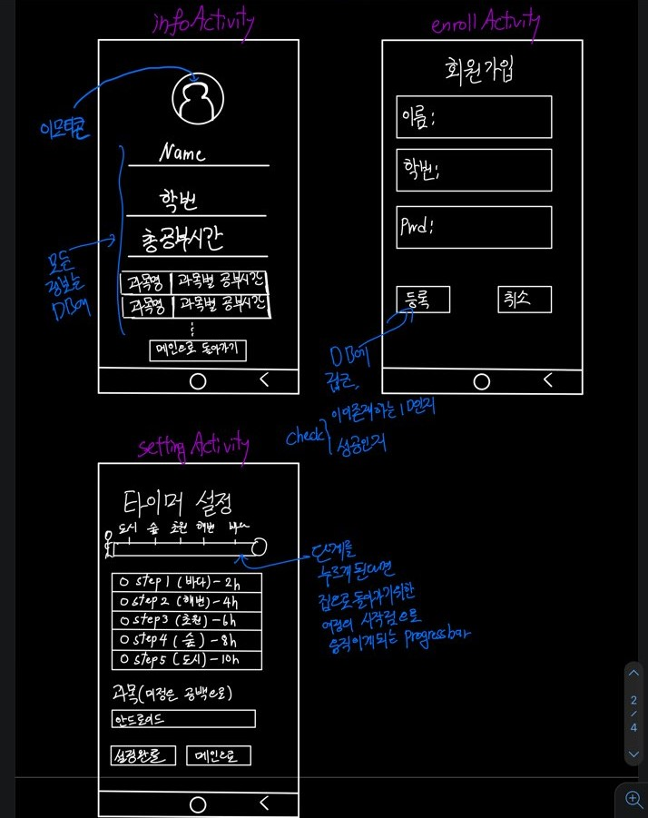

## 4주차 보고서

### 활동내용 : 애플리케이션 레이아웃 가시화, 기능설명 추가 / 애플리케이션 액티비티 및 xml(버튼, 라디오버튼, 뷰들의 변수 설정)

3주차때 만들어둔 스케치를 가지고 보기 편하고 실제로 만들 애플리케이션의 화면을 그림을 그려서 표현을 해두었고, 어떤 기능을 넣을 것인지 가시화 했음. 또한 실제로 우리가 만들 프로젝트를 생성해서 프런트(외관)부분을 생성하고 테스트에 성공했음

### 작업  결과

프로젝트의 가시화

실제 프로젝트는 

https://github.com/HMTA-Hansung-Mascot-Timer-Application

---

3주차의 결과를 위해 소모된 시간

- 각자 가시화시켜두는 작업과 실제 안드로이드의 외관 틀을 만드는 작업을 분할해서 작업했음 (6시간)
- 각자 역할
  - 유승원 : 애플리케이션의 액티비티를 에뮬레이터를 통해서 기능부여는 하지 않았지만 외관적인 부분을 생성해서 어떻게 생긴 애플리케이션인지 생성함
  - 심규도 : 지난주에 챙겨두었던 3주차 스케치를 실제 애플리케이션을 생성할때 참고할 수 있도록 가시화시키고 어떤 기능을 넣을 것인지에 그림 정리함

질문사항

- 초기에 생각했던 부분은 타이머 설정에들어가서 설정을하고, 설정값들을 메인(초기)화면으로 인텐트로 가지고 온 다음, 그 인텐트들을 타이머 시작을 눌렀을때 가지고 타이머 액티비티로 가지고 갈 것인지 
- 시작을 눌렀을 때 설정액티비티로 가지고 설정값을 누르게 된다면 설정값들을 인텐트로 가지고 바로 타이머액티비티로 넘어가져서 타이머를 시작할 건지

